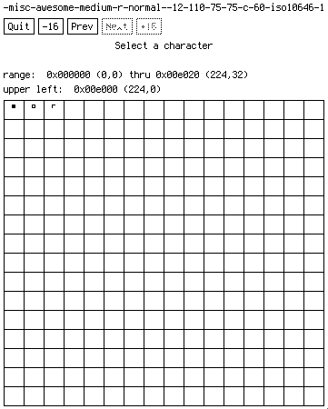
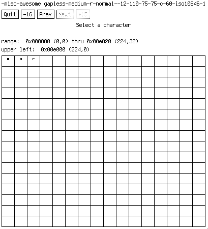

# Awesome font

Custom font to mimic [Awesome](https://awesomewm.org)'s [workspace tag symbols](https://github.com/awesomeWM/awesome/blob/master/lib/beautiful/theme_assets.lua) in [polybar](https://polybar.github.io).

### Example polybar config

```ini
[bar/top]
...
font-5 = awesome gapless:size=12;-4
...
ws-label-active = "%{T6}%{T-}%icon%%{T6} %{T-}"
ws-label-occupied = "%{T6}%{T-}%icon%%{T6} %{T-}"
ws-label-urgent = "%{T6}%{T-}%icon%%{T6} %{T-}"
ws-label-empty = "%{T6} %{T-}%icon%%{T6} %{T-}"
...
[module/ewmh]
type = internal/xworkspaces
...
label-active = ${root.ws-label-active}
label-occupied = ${root.ws-label-occupied}
label-urgent = ${root.ws-label-urgent}
label-empty = ${root.ws-label-empty}
```

### Supported characters

| Code      | Character        |
| --------- | ---------------- |
| U+0032    | space            |
| U+E000    | squares sel fill |
| U+E001    | squares sel      |
| U+E002    | squares unsel    |

 
